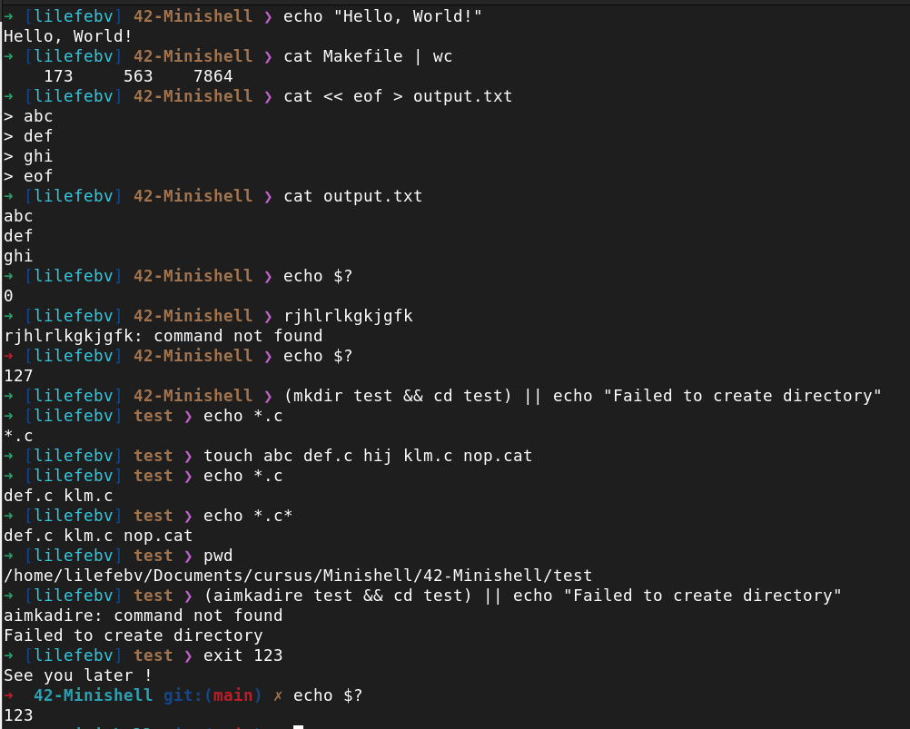
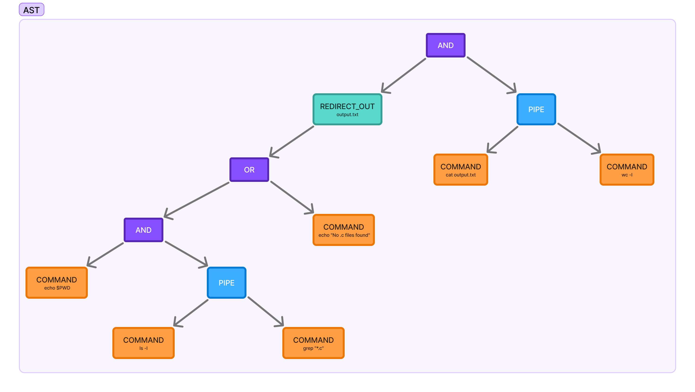
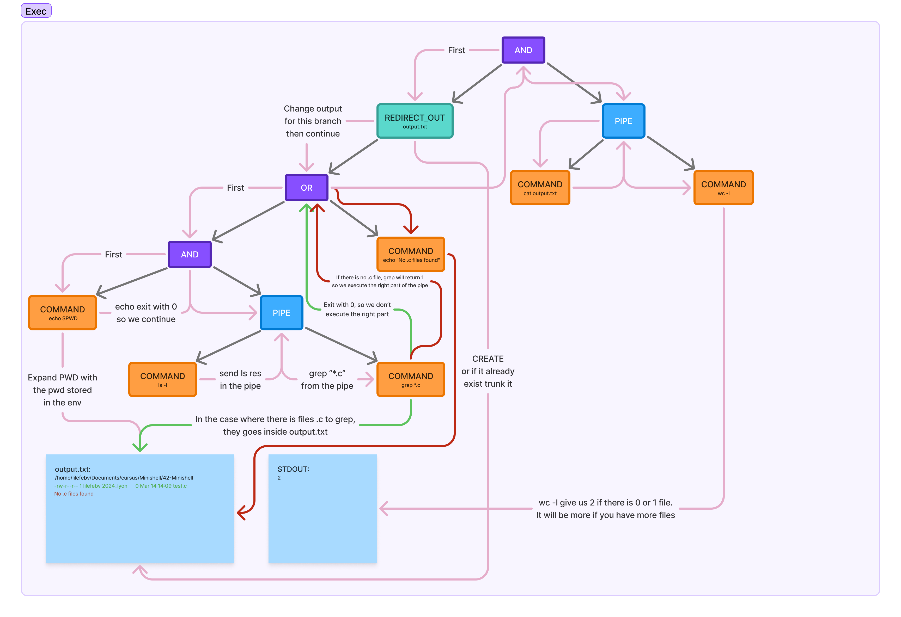

<p align='center'>
   <a href="https://www.linux.org/">
      </a>
   <a href="https://wakatime.com/badge/user/7d36b55a-b5ff-46c4-b7fd-57604568d382/project/7646dba2-55e4-45a5-87c0-3e0fecfb92a5">
      </a>
</p>

# Minishell

**Minishell** is a project from 42 School that challenges us to recreate a minimal yet functional Unix shell almost from scratch. Built entirely in C, this project was built by the two of us, pushing our skills in system programming, process management, and string parsing to the limit—while also pushing our patience to its breaking point more times than we'd like to admit!

## 🚀 Features

- **Custom Prompt** → A stylish arrow that changes color based on the last return value.
- **Command Execution** → Run executables from the system's `$PATH`, including absolute and relative paths.
- **Pipes (`|`)** → Chain multiple commands together, just like in a real shell.
- **Redirections (`>`, `>>`, `<`, `<<`)** → Handle file input/output redirections seamlessly.
- **Environment Variables (`$VAR`)** → Expand variables, including `$?` for the last command’s exit status.
- **Built-in Commands** → Includes `echo`, `cd`, `pwd`, `export`, `unset`, `env`, and `exit`.
- **Signal Handling** → Proper response to `Ctrl-C`, `Ctrl-D`, and `Ctrl-\`.
- **Logical Operators (`&&` and `||`)** → Execute commands conditionally based on exit statuses.
- **Wildcard Expansion (`*`)** → Expand wildcards (only on the current directory).

## 🎭 Example Usages



## ⚙️ How It Works

Minishell is not just a simple command parser. It follows a structured pipeline to interpret and execute commands:

1. **Lexing & Tokenization** → The input string is split into tokens and stored in a linked list.
2. **Syntax Validation** → We ensure the correct use of quotes, parentheses, pipes, and redirections.
3. **Here-Document Processing** → If `<<` is detected, we pre-fetch user input and store it in a temporary file.
4. **Abstract Syntax Tree (AST) Construction** → Commands are structured hierarchically based on their execution order.
5. **Execution** → The AST is recursively executed, handling pipes, redirections, and operators dynamically.

### Example

With the command :
```bash
➜ [lilefebv] 42-Minishell ❯ (echo $PWD && (ls -l | grep *.c) || echo "No .c files found") > output.txt && cat output.txt | wc -l
```

First this command is tokenized. It transform into this :
```
        Token                       Text     Previous       Self       Next
   PAREN_OPEN                     (null)        (nil)  0x1a78b40  0x1a78b70
      COMMAND                  echo $PWD    0x1a78b40  0x1a78b70  0x1a78ba0
          AND                     (null)    0x1a78b70  0x1a78ba0  0x1a78bf0
   PAREN_OPEN                     (null)    0x1a78ba0  0x1a78bf0  0x1a78c20
      COMMAND                      ls -l    0x1a78bf0  0x1a78c20  0x1a78c70
         PIPE                     (null)    0x1a78c20  0x1a78c70  0x1a78ca0
      COMMAND                 grep "*.c"    0x1a78c70  0x1a78ca0  0x1a78a30
  PAREN_CLOSE                     (null)    0x1a78ca0  0x1a78a30  0x1a78cf0
           OR                     (null)    0x1a78a30  0x1a78cf0  0x1a5b190
      COMMAND   echo "No .c files found"    0x1a78cf0  0x1a5b190  0x1a78950
  PAREN_CLOSE                     (null)    0x1a5b190  0x1a78950  0x1a78980
 REDIRECT_OUT                     (null)    0x1a78950  0x1a78980  0x1a789b0
       FILE_R                 output.txt    0x1a78980  0x1a789b0  0x1a78a00
          AND                     (null)    0x1a789b0  0x1a78a00  0x1a78b10
      COMMAND             cat output.txt    0x1a78a00  0x1a78b10  0x1a78a80
         PIPE                     (null)    0x1a78b10  0x1a78a80  0x1a78ab0
      COMMAND                      wc -l    0x1a78a80  0x1a78ab0      (nil)
```

The syntax here is valid, there isn't 2 consecutive operators or things like this so we can go to the next step.

The next step is the creation of the tree. It will look like that :



And lastly, the execution recursively do it's job.
- A command node is executed
- A redirect node change the input or output where all the commands under it will input/output their content.
- A pipe open a pipe between the left node and the right node. Basicly it do the same thing as a redirect but with a pipe. That mean that we can have more things under it, not just a command.
- A AND/OR node will execute it's left part, and the execution of the right part depend on the return of the commands

And here is how is it interpreted. (yes, seeing this can cause headheakes)



## Conclusion

This wasn't the project I prefered, but it allow us to see a lot of different notions and understand how a shell really work.

This minishell is pretty solid, it survived multiple beatings by others students, pushing it to it's limits. If you found a bug or crash feel free to open an issue (I don't garranty you we will have the motivation to correct it).

Hope this readme helped you understand how our minishell works!

## 🔗 Contributors
- [Audric](https://github.com/pandhacker)
- [Liam](https://github.com/Liammmmmmmm)

